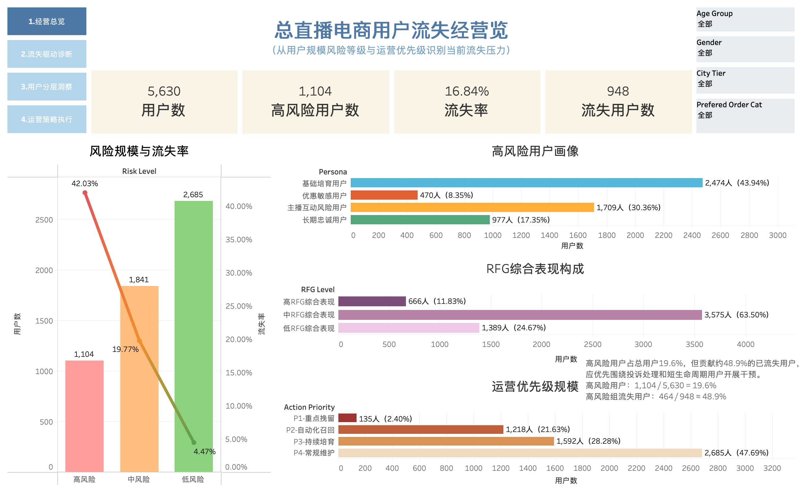
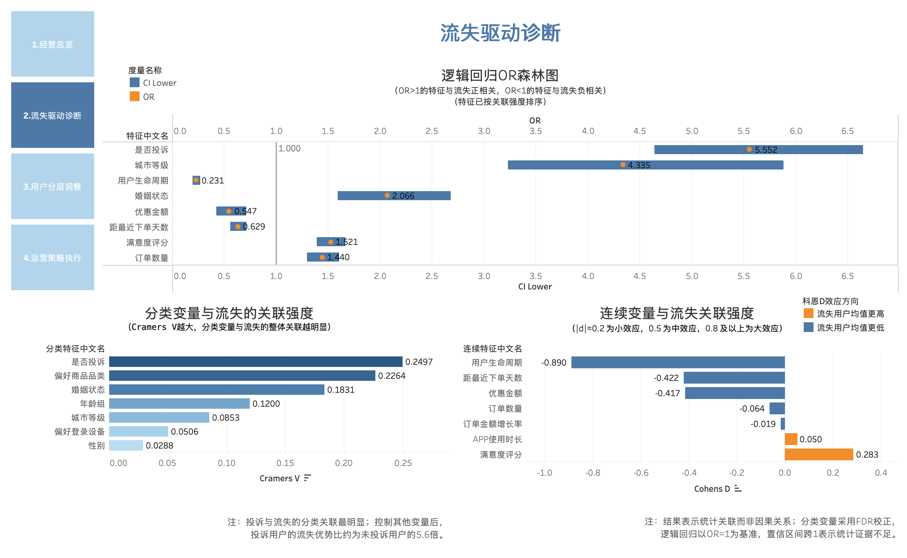
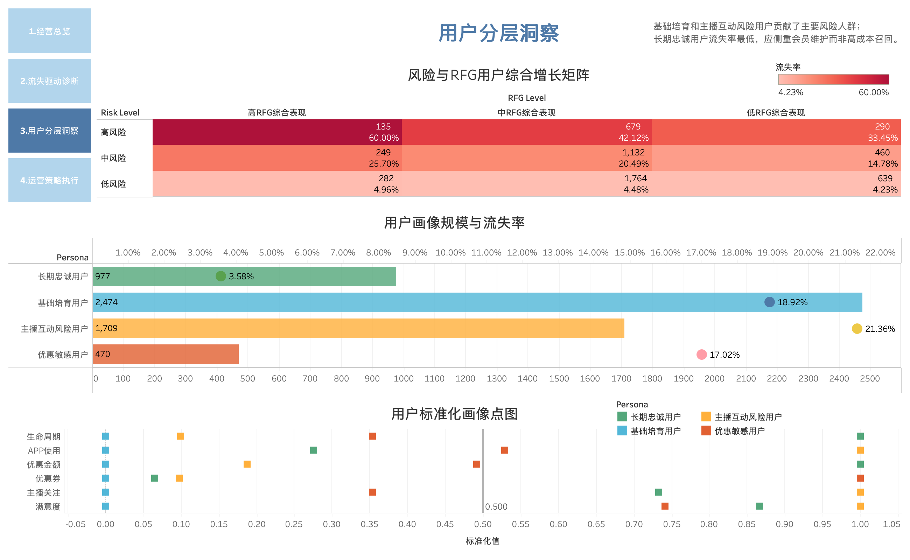
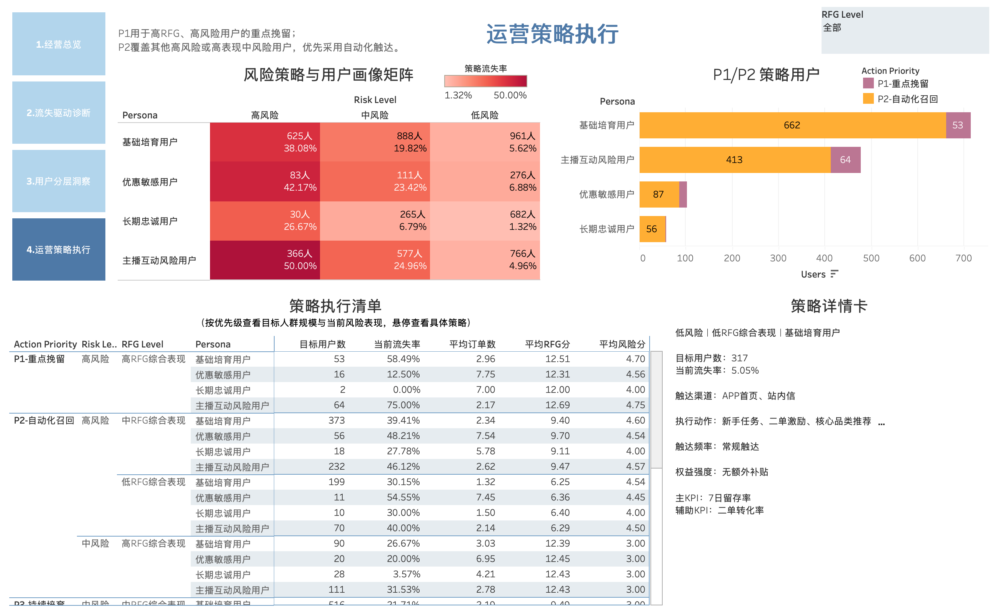

# 直播电商用户流失分析与运营策略

基于5,630名直播电商用户的行为、交易与互动数据，识别用户流失驱动因素，构建风险、RFG与用户画像分层体系，并形成差异化用户运营策略。



## 项目概览

本项目围绕直播电商平台的用户流失问题，建立“流失诊断—用户分层—策略制定—效果验证”的分析框架，回答以下业务问题：

1. 平台整体流失情况如何？
2. 哪些用户特征与流失存在显著关联？
3. 高风险用户主要集中在哪些价值层级和用户画像？
4. 哪些用户应被优先挽留？
5. 不同用户群体应采用怎样的触达、权益和运营策略？

## 核心结果

| 指标 | 结果 |
|---|---:|
| 用户数 | 5,630 |
| 流失用户数 | 948 |
| 整体流失率 | 16.84% |
| 高风险用户数 | 1,104 |
| 高风险用户流失率 | 42.03% |
| P1重点挽留用户 | 135 |
| P2自动化召回用户 | 1,218 |

主要发现：

- 投诉是关联较强且可干预的分类风险信号，投诉用户流失率明显更高。
- 用户生命周期是区分流失与留存用户的重要连续变量，生命周期较短的用户风险更高。
- 高风险用户流失率达到42.03%，明显高于中风险和低风险用户。
- 主播互动风险用户流失率最高，适合通过主播回访、直播预约提醒和粉丝权益进行干预。
- 高风险且高RFG用户被划入P1重点挽留人群，应优先配置人工触达和较高价值权益。

## 分析框架

```text
数据质量检查
→ 特征工程
→ 单变量流失分析
→ 卡方检验与Cramér's V
→ Welch t检验与Cohen's d
→ 多变量逻辑回归
→ RFG用户价值分层
→ KMeans用户画像
→ 规则型风险分层
→ 运营策略设计
→ Tableau可视化
```

## 分析方法

### 流失关联诊断

- 分类变量：卡方检验、Cramér's V、FDR多重检验校正
- 连续变量：Welch t检验、Cohen's d、FDR多重检验校正
- 多变量分析：逻辑回归、Odds Ratio及95%置信区间
- 共线性检查：VIF

本项目将统计结果解释为变量与流失之间的关联，不将其直接表述为因果关系。

### 用户分层

用户分层由三个互补维度组成：

- 风险层级：根据用户生命周期和投诉行为划分低、中、高风险。
- RFG层级：根据最近下单、订单频次和订单增长表现衡量用户综合价值。
- Persona：通过KMeans聚类识别基础培育、长期忠诚、主播互动风险和优惠敏感四类用户。

KMeans结果用于探索性用户画像，不代表绝对或固定的用户类别。

### 策略优先级

| 优先级 | 目标人群 | 策略方向 |
|---|---|---|
| P1 重点挽留 | 高风险且高RFG用户 | 人工优先触达、重点权益 |
| P2 自动化召回 | 其他高风险或高价值中风险用户 | 自动化召回、Persona差异化策略 |
| P3 持续培育 | 其他中风险用户 | 低成本定向培育 |
| P4 常规维护 | 低风险用户 | 常规运营、控制补贴成本 |

## Tableau Dashboard

### 1. 经营总览

展示用户规模、流失率、高风险用户、风险层级、用户画像、RFG构成和策略优先级。


### 2. 流失驱动诊断

展示逻辑回归OR森林图、分类变量关联强度和连续变量组间差异。



### 3. 用户分层洞察

结合Risk Level、RFG Level和Persona识别高价值、高风险目标人群。



### 4. 运营策略执行

展示风险策略矩阵、P1/P2策略用户、策略执行清单和选中人群详情。



## 项目文件

- [完整分析Notebook](分析代码/直播电商用户流失分析.ipynb)
- [Tableau打包工作簿](看板/直播电商用户流失分析.twbx?raw=1)
- [完整项目报告](文档/直播电商用户流失分析项目报告.pdf)
- [原始数据](数据/原始数据/Project%20Dataset.csv)
- [聚合分析结果](数据/处理后数据/)
- [数据来源：阿里云天池直播电商数据集](https://tianchi.aliyun.com/dataset/124814)

> 本项目基于阿里云天池公开数据集完成，仅用于个人学习与非商业求职展示。原始数据及相关权利归原发布方所有，使用者应遵守天池平台服务协议及数据发布方的相关规定。

## 技术工具

- Python：Pandas、NumPy
- 统计分析：SciPy、Statsmodels
- 用户分群：Scikit-learn
- 可视化：Matplotlib、Seaborn、Tableau
- 文档与版本管理：Jupyter Notebook、GitHub

## 数据质量

- 原始记录：5,630条
- 唯一用户：5,630位
- 重复用户：0
- 清洗后缺失值：0
- Risk、RFG、Persona和策略字段覆盖率：100%
- 连续变量采用中位数填充，计数变量使用取整后的中位数填充
- 对异常值进行业务范围检查，不根据流失标签删除或修改异常值

## 局限性与下一步

- 数据为用户横截面数据，不能直接识别时间上的因果关系。
- 风险等级属于可解释的规则型分层，并非真实上线后的预测概率。
- KMeans聚类的群体边界存在重叠，画像用于运营探索。
- 策略效果尚未通过真实实验验证。
- 后续可在相同Risk、RFG和Persona层内开展随机A/B测试，比较30日增量留存率、增量复购率及单位挽留成本。

## 项目结构

```text
直播电商用户流失分析/
├── README.md
├── 分析代码/
├── 数据/
│   ├── 原始数据/
│   └── 处理后数据/
├── 看板/
├── 文档/
└── 图片/
```